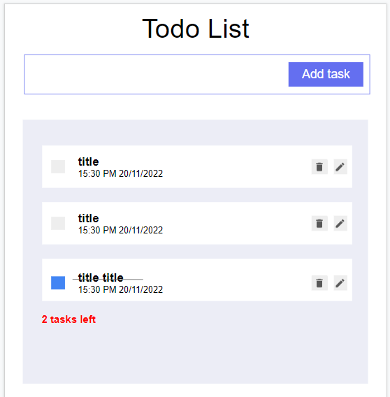

<!-- TABLE OF CONTENTS -->
<details>
  <summary>Table of Contents</summary>
  <ol>
    <li>
      <a href="#about-the-project">About The Project</a>
      <ul>
        <li><a href="#built-with">Built With</a></li>
      </ul>
    </li>
    <li>
      <a href="#getting-started">Getting Started</a>
      <ul>
        <li><a href="#installation">Installation</a></li>
      </ul>
    </li>
    <li><a href="#usage">Usage</a></li>
    <li><a href="#roadmap">Roadmap</a></li>
    <li><a href="#contributing">Contributing</a></li>
    <li><a href="#license">License</a></li>
    <li><a href="#acknowledgments">Used tool</a></li>
    <li><a href="#acknowledgments">Extensions</a></li>
    <li><a href="#acknowledgments">Acknowledgments</a></li>
  </ol>
</details>

<!-- ABOUT THE PROJECT -->
## About The Project
* A complete todo application with CRUD.

### Built With

* [![React][React.js]][React-url]

<!-- GETTING STARTED -->
## Getting Started

This is the instructions to set up your project locally.
You can start the project on your own by following the guide below.

### Installation

_Below is an example of how you can instruct your audience on installing and setting up your app. This template doesn't rely on any external dependencies or services._

1. Clone the repo
   ```sh
   git clone https://github.com/hienluong97/training_todoapp.git
   ```
2. Install NPM packages
   ```sh
   npm install
   ```
3. Runs the app in the development mode.
   ```sh
   npm start
   ```

<!-- USAGE EXAMPLES -->
## Usage

Use this space to show useful examples of how a project can be used. Additional screenshots, code examples and demos work well in this space. You may also link to more resources.

_For more examples, please refer to the [Documentation](https://example.com)_


<!-- ROADMAP -->
## Roadmap

- [x] Add Changelog
- [x] Add back to top links
- [ ] Add Additional Templates w/ Examples
- [ ] Add "components" document to easily copy & paste sections of the readme
- [ ] Multi-language Support
    - [ ] Chinese
    - [ ] Spanish

See the [open issues](https://github.com/othneildrew/Best-README-Template/issues) for a full list of proposed features (and known issues).


<!-- CONTRIBUTING -->
## Contributing

Contributions are what make the open source community such an amazing place to learn, inspire, and create. Any contributions you make are **greatly appreciated**.

If you have a suggestion that would make this better, please fork the repo and create a pull request. You can also simply open an issue with the tag "enhancement".
Don't forget to give the project a star! Thanks again!

1. Fork the Project
2. Create your Feature Branch (`git checkout -b feature/AmazingFeature`)
3. Commit your Changes (`git commit -m 'Add some AmazingFeature'`)
4. Push to the Branch (`git push origin feature/AmazingFeature`)
5. Open a Pull Request


<!-- LICENSE -->
## License

Distributed under the MIT License. See `LICENSE.txt` for more information.

<!-- Tools Used -->
## Tools Used

Use this space to list resources you find helpful and would like to give credit to. I've included a few of my favorites to kick things off!

* [VS code ](https://code.visualstudio.com/)
* [Open API](https://swagger.io/)
* [Font Awesome](https://fontawesome.com)

<!-- Extensions -->
## Extensions

Use this space to list resources you find helpful and would like to give credit to. I've included a few of my favorites to kick things off!

* [Swagger Viewer ](https://marketplace.visualstudio.com/items?itemName=Arjun.swagger-viewer)
* [OpenAPI Swagger Editor](https://marketplace.visualstudio.com/items?itemName=42Crunch.vscode-openapi)
* [OpenApi Snippets](https://marketplace.visualstudio.com/items?itemName=proohit.openapi-snippets)


<!-- ACKNOWLEDGMENTS -->
## Acknowledgments

Use this space to list resources you find helpful and would like to give credit to. I've included a few of my favorites to kick things off!

* [React documentation ](https://reactjs.org/)


<!-- MARKDOWN LINKS & IMAGES -->
[React.js]: https://img.shields.io/badge/React-20232A?style=for-the-badge&logo=react&logoColor=61DAFB
[React-url]: https://reactjs.org/
